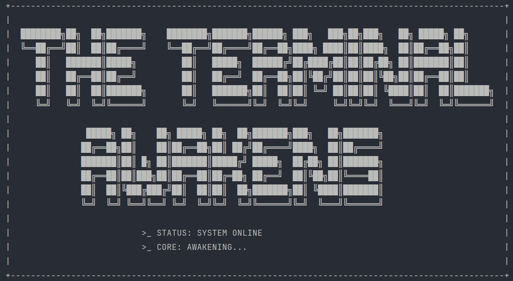
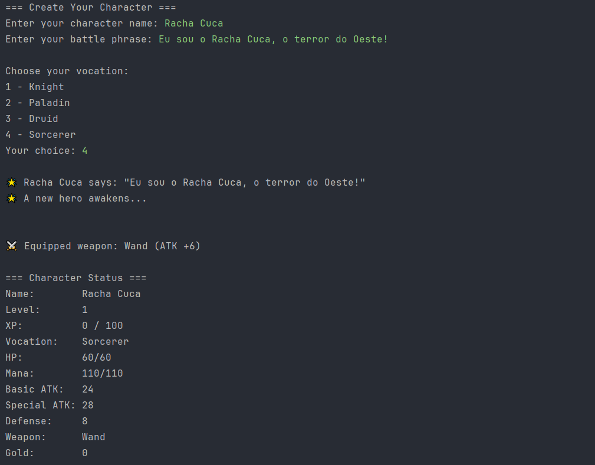
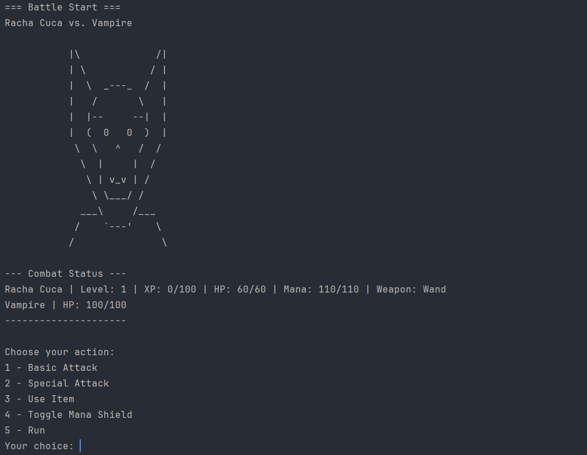
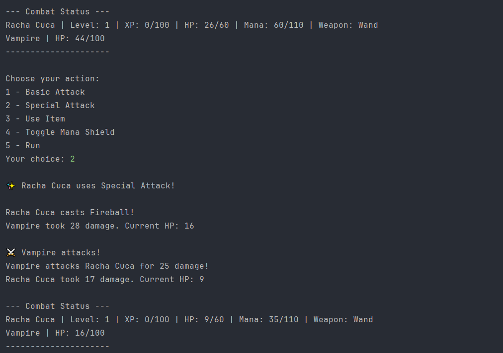
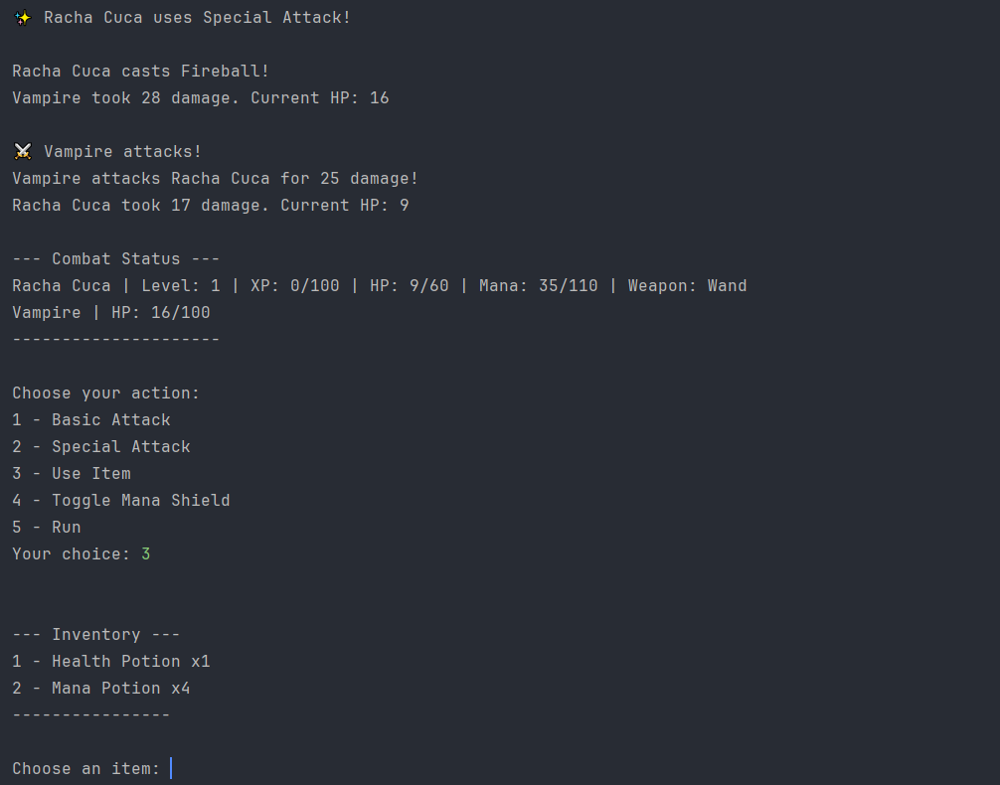
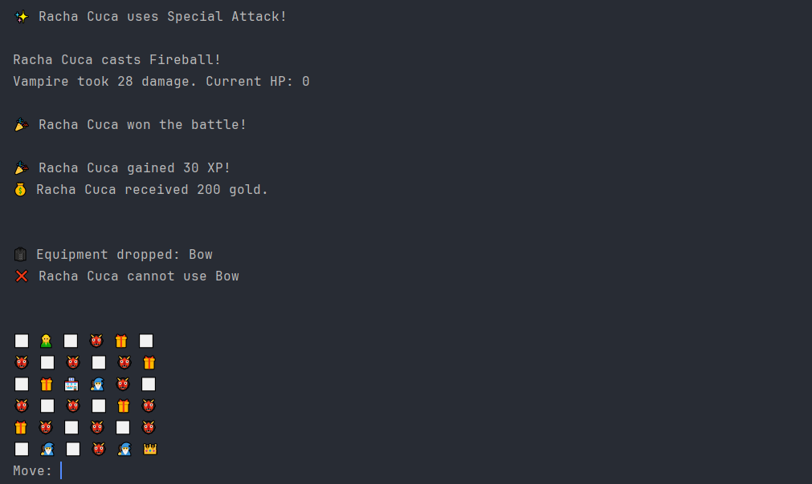
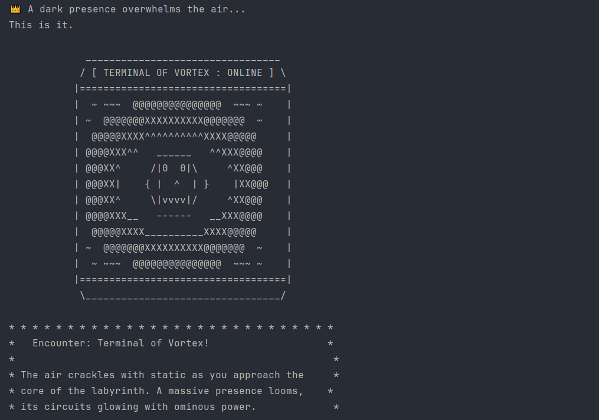

<h1 align="center">
  👁️🖥️ The Terminal Awakens 🖥️👁️
</h1>

<p align="center">
  🌎 <strong>Languages:</strong><br>
  <a href="README.pt.md">🇧🇷 Portuguese</a> |
  <a href="README.md">🇺🇸 English</a>
</p>

**The Terminal Awakens** is a **terminal-based RPG adventure game in Java**, where players explore a dungeon-like world, battle monsters, and grow their characters through XP, levels, and equipment.  

The project features:

- Multiple **vocations/classes**: Knight, Paladin, Druid, Sorcerer  
- **Turn-based combat** with special attacks and mana management  
- **Equipment system**: Weapons and armor with bonuses  
- **Inventory & items**: Health and Mana potions  
- **Map exploration**: Random encounters, shops, NPCs, and final boss  
- **ASCII portraits** and immersive text UI  

---

## 🏆 Motivation

This project was created as a **personal learning project in Java**, focused on:

- Practicing **OOP, inheritance, and polymorphism**  
- Building **terminal-based games** with clean code structure  
- Implementing **combat mechanics, inventory systems, and level progression**  
- Exploring **game balance, UX, and terminal graphics**  

It was also an opportunity to reinforce concepts like:

- Designing **class hierarchies and abstract classes** for reusability  
- Managing **game loops, events, and player states**  
- Implementing **equipment, items, and stats system** in a RPG context  

## 📸 Screenshots

Below are some screenshots showcasing key moments of **The Terminal Awakens** gameplay.

### 1. 🖥️ Game Start — ANSI Title Screen
The ASCII art displayed when the game starts, presenting the world of **The Terminal Awakens**.



---

### 2. 🧙 Character Creation & Starter Kit
The beginning of the journey, where the player chooses a vocation and receives the starter equipment.



---

### 3. ⚔️ Combat Example
A turn-based combat scenario against common enemies.





---

### 4. 🎒 Inventory View
Viewing and using items such as Health and Mana Potions during gameplay.



---

### 5. 🗺️ Map Exploration
Exploring the map, discovering paths, encounters, and hidden events.



---

### 6. 🐉 Boss Encounter
A dangerous boss fight that tests strategy, resource management, and survival.



 
## 📚 Learning Points

During development, these concepts were reinforced:

- **Backend / Game Logic (Java)**  
  - Abstract classes and polymorphism for characters  
  - Combat mechanics and turn-based system  
  - Equipment and inventory system  
  - XP, level progression, and stat growth  
  - Map, tiles, and event handling  

- **Terminal UX & ASCII Art**  
  - Dynamic combat/status displays  
  - Grouped inventory and narrative messages  
  - Boss and monster portraits  
  - Slow console printing for immersion


## 🚀 How to Run Locally

### 📦 Prerequisites

Make sure you have:

- **Java 21+** installed  
- **Terminal / Command Prompt**  

### 🖥️ Run the Game

1. Compile the project:

```bash
javac -d out/production/the-terminal-awakens src/main/java/com/terminalawakens/**/*.java
```

2. Run the game:
```bash
java -cp out/production/the-terminal-awakens com.terminalawakens.Main
```
3. Follow the in-terminal prompts to:
   - Create your character
   - Explore the map using AWSD keys
   - Fight monsters
   - Visit shops and collect loot
   - Challenge the final boss **Terminal of Vortex**

## 🧱 Project Structure
```bash
the-terminal-awakens/
├─ src/main/java/com/terminalawakens/
│  ├─ character/          # Character classes, starter kit, stats, equipment
│  ├─ creatures/          # Monsters, bosses, MonsterFactory
│  ├─ engine/             # GameEngine & CombatEngine
│  ├─ equipment/          # Weapons, armor, equipment logic
│  ├─ items/              # Potions and ItemFactory
│  ├─ shop/               # Item and equipment shop
│  ├─ util/messages/      # ASCII portraits, SlowConsole, GameStart/GameEnd
│  └─ world/              # Game map, tile types, position handling
├─ out/                   # Compiled .class files
├─ screenshots/           # Suggested screenshots folder
├─ .gitignore
├─ LICENSE
└─ README.md
└─ README.pt.md
```

## 🎮 Gameplay Flow
```text
Character Creation
 ↓
Game Map Exploration (AWSD)
 ↓
Random Tile Events:
   - Monster Encounter → CombatEngine
   - Loot Tile → Collect items
   - Shop Tile → Buy equipment
   - NPC Tile → Dialogue / Lore
 ↓
XP & Level Up → Character Growth
 ↓
Boss Tile → Terminal of Vortex
```

## 📜 License

This project is licensed under the **MIT License** — feel free to use, study, and modify it.

## 🧑‍💻 Author

**Piter Gomes** — Computer Science Student (6th Semester) & Full-Stack Developer

📧 [Email](mailto:piterg.bio@gmail.com) | 💼 [LinkedIn](https://www.linkedin.com/in/piter-gomes-4a39281a1/) | 💻 [GitHub](https://github.com/pitercoding) | 🌐 [Portfolio](https://portfolio-pitergomes.vercel.app/)
